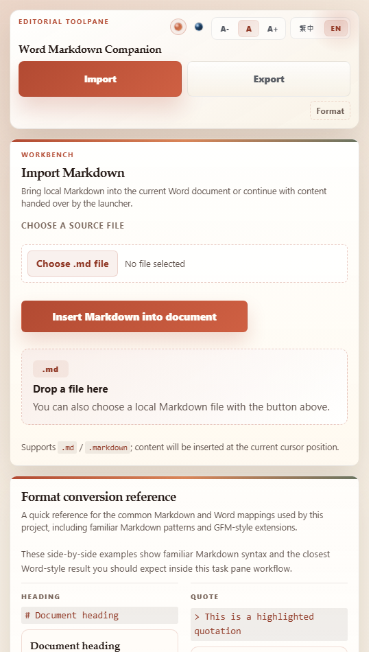
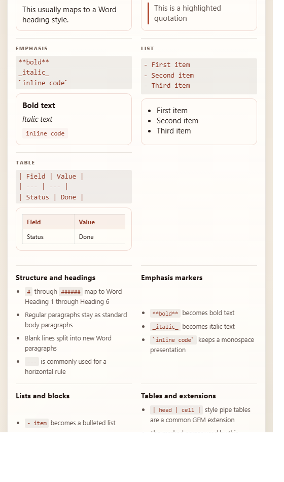

[](https://github.colorgeek.co/word-markdown-addin/install.html)

# WORD MARKDOWN COMPANION

**在 Microsoft Word 內匯入、整理、匯出 Markdown**


[Live Site](https://github.colorgeek.co/word-markdown-addin/) ·
[Install](https://github.colorgeek.co/word-markdown-addin/install.html) ·
[快速開始](#快速開始) ·
[文件](#文件) ·
[English](README.md)

---

## 為什麼需要 Word Markdown Companion

Word Markdown Companion 把 Markdown 匯入與匯出放進 Word task pane，同時保留公開 HTTPS 發布路徑與 Windows Desktop sideload 測試路徑。寫作者可以維持 `.md` 工作流，再把內容帶進 Word 做編修、審閱或交付。

| 好處 | 提供能力 |
|---|---|
| **Markdown 匯入** | 選取或拖放 `.md` / `.markdown` 檔 — 插入目前 Word 文件 |
| **Markdown 匯出** | 將目前 Word 文件轉成 Markdown — 預覽、複製、下載或另存 |
| **公開 add-in 路徑** | HTTPS manifest、support page、privacy page、GitHub Pages 靜態 host |
| **Windows 本機路徑** | Localhost dev server、sideload manifest、可選 `.md` shell handoff bridge |

---

## 介面截圖

| Task pane 上半部 | Task pane 下半部 |
|---|---|
|  |  |

目前英文 task pane 展示匯入流程、已本地化的檔案選擇器、拖放區與 Markdown 轉換參考。

> **品牌素材規則：** 舊 mascot artwork 只作為來源素材，不是 README 展示素材。不得直接把 mascot 放進文件或產品介面；必須先重新設計成核准的 banner、campaign 或 product artwork 才能使用。

---

## 運作方式

### 1. 安裝或 sideload manifest

線上版從公開 install page 開始；本機開發則使用 Windows sideload 指令。

### 2. 在 Word 開啟 task pane

Manifest 會讓 Word 載入 `taskpane.html`。線上版由公開 HTTPS host 提供，本機版由 localhost dev server 提供。

### 3. 匯入、整理或匯出 Markdown

在同一個 task pane 工作區使用 `Import .md`、拖放、`Format` 或 `Export .md`。

---

## 適合對象

| 使用者 | 能完成的事 |
|---|---|
| Markdown-first 寫作者 | 用 `.md` 草稿，轉進 Word 進行審閱或交付 |
| Word-heavy 團隊 | 在 Word 編輯介面內接收 Markdown 來源 |
| Add-in 測試者 | 用同一條 manifest 路徑驗證 Word Desktop 與 Word Online |
| Windows 本機使用者 | 測試 sideload、shell association 與 launcher bridge，不必先發布 |

---

## 支援矩陣

| 類型 | 支援 |
|---|---|
| 輸入 | `.md`、`.markdown`、常見 Markdown、GFM-style tables |
| 輸出 | Markdown 預覽、剪貼簿複製、檔案下載、save picker fallback |
| 線上 host | GitHub Pages 靜態站、HTTPS manifest、公開 support / privacy page |
| Word 平台 | Word Desktop、Word Online、Office manifest validation 允許的平台 |
| 本機開發 | Windows Word Desktop sideload、localhost dev server、可選 `.md` association |

> **重要：** 線上版不包含 Windows registry 修改、`.md` 檔案關聯、`.local/pending-open.json` 或 localhost launcher bridge。

---

## 快速開始

開啟公開安裝頁：

**[https://github.colorgeek.co/word-markdown-addin/install.html](https://github.colorgeek.co/word-markdown-addin/install.html)**

### 公開 HTTPS 建置

```powershell
# 建置公開 Office Add-in bundle
cd Q:\Projects\word-markdown-addin
$env:MANIFEST_HOST = "https://github.colorgeek.co/word-markdown-addin"
$env:SUPPORT_URL = "https://github.colorgeek.co/word-markdown-addin/support.html"
npm run build:online
```

### Windows Desktop Sideload

```powershell
# 準備本機 helper 路徑並 sideload 到 Word Desktop
cd Q:\Projects\word-markdown-addin
npm run single-machine
```

### 開發檢查

```powershell
# 執行高訊號本機驗證
npm test

# 啟動本機 task pane server 進行人工檢查
npm run dev-server
```

---

## 公開網址

| 介面 | URL |
|---|---|
| Public site | `https://github.colorgeek.co/word-markdown-addin/` |
| Install page | `https://github.colorgeek.co/word-markdown-addin/install.html` |
| Manifest | `https://github.colorgeek.co/word-markdown-addin/manifest.store.xml` |
| Task pane | `https://github.colorgeek.co/word-markdown-addin/taskpane.html` |
| Support | `https://github.colorgeek.co/word-markdown-addin/support.html` |
| Privacy | `https://github.colorgeek.co/word-markdown-addin/privacy.html` |

---

## 文件

| 主題 | 檔案 |
|---|---|
| 線上安裝 | [docs/online-install.md](docs/online-install.md) |
| 線上發布 | [docs/publish-online.md](docs/publish-online.md) |
| GitHub Pages 部署 | [docs/github-pages.md](docs/github-pages.md) |
| 線上 smoke test | [docs/online-smoke-test.md](docs/online-smoke-test.md) |
| Windows 單機路徑 | [docs/single-machine.md](docs/single-machine.md) |
| 發布前檢查 | [docs/release-checklist.md](docs/release-checklist.md) |
| Skill list | [docs/skill-list.md](docs/skill-list.md) |

---

## AI-Assisted Development

本專案開發過程使用 AI 協助。

| Model | Role |
|---|---|
| OpenAI Codex CLI | 實作、文件、UI/i18n review |

> **Disclaimer:** 作者已盡力審查與驗證 AI 產生的程式碼，但不保證其正確性、安全性，或適用於任何特定目的。請自行承擔使用風險。

---

## License

[MIT License](LICENSE)
